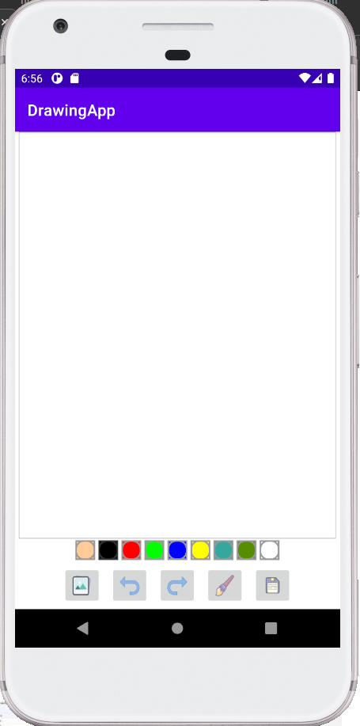
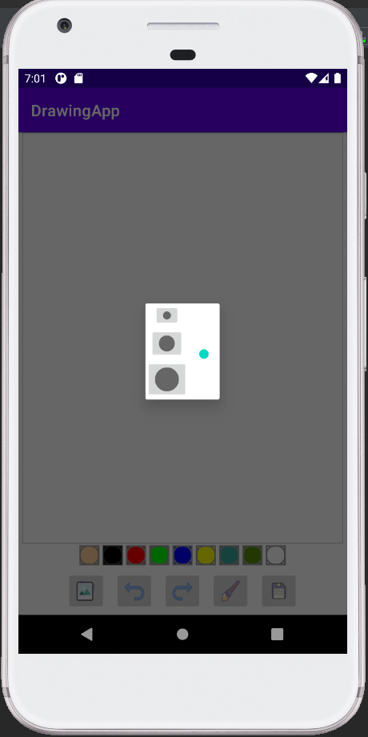
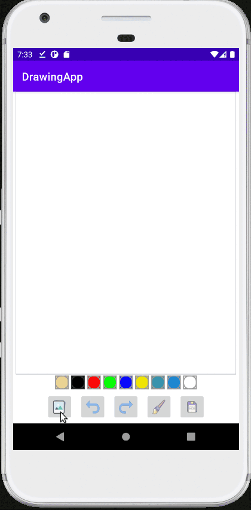
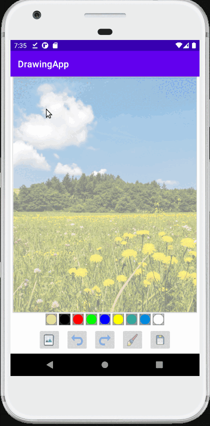

# DrawingApp

Application allows painting with a number of colors. 
User can:
- remove or redo each stroke,
- paint on top of image selected from device memory,
- select from three brush sizes,
- save finished image to device memory.

Used technologies:
- kotlin,
- storage permissions,
- seek bar,
- finding views from layout with view binding.

Initial app screen           |  Brush size screen
:-------------------------:|:-------------------------:
  |   
 
<h3>Opening file for canvas:</h3>
 

 
<h3>Selecting brush size and drawing of lines:</h3> 

 
<h3>Undu and redo:</h3> 

 
